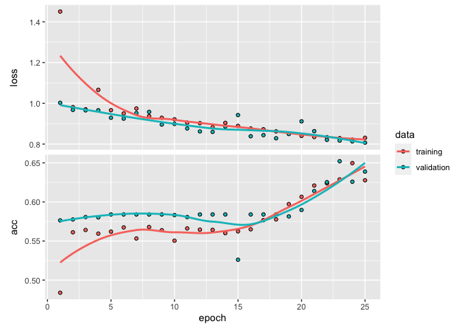

```r
library(keras)
```

```
## Warning: package 'keras' was built under R version 3.6.2
```


```r
input_img_paths <- list.files(path = "pet_dataset/images/", pattern = "\\.jpg", full.names = T)
target_paths <- list.files(path = "pet_dataset/annotations/trimaps/", pattern = "\\.png", full.names = T)
```


```r
img_size <- c(200, 200)                                                  
num_imgs <- length(input_img_paths)      
```


```r
set.seed(1337)
input_img_paths <- sample(sort(input_img_paths), size = num_imgs)
set.seed(1337)
target_paths <- sample((target_paths), size = num_imgs)
```


```r
path_to_input_image <- function(path,img_size){
    image_to_array(
      image_load(path, target_size=img_size)
      ) / 255
}
```


```r
path_to_target <- function(path, img_size){
    image_to_array(
      image_load(path, target_size=img_size, grayscale = T)
      ) - 1
}
```


```r
input_imgs <- array(0, c(num_imgs, img_size, 3))
targets <- array(0, c(num_imgs, img_size, 1))
```


```r
for(i in 1:num_imgs){
  input_imgs[i,,,] <- path_to_input_image(input_img_paths[i], img_size)
  targets[i,,,] <- path_to_target(target_paths[i], img_size)  
}
```

```
## Loaded Tensorflow version 2.6.2
```


```r
num_val_samples <- 1000                                                
train_input_imgs <- input_imgs[1:num_val_samples,,,]                      
train_targets <- targets[1:num_val_samples,,,]                            
val_input_imgs <- input_imgs[(num_val_samples+1):num_imgs,,,]                        
val_targets <- targets[(num_val_samples+1):num_imgs,,,]
```


```r
input_tensor <- layer_input(shape=c(img_size,3))  

predictions <- input_tensor %>%
  layer_rescaling(scale = 1/255)  %>%
  layer_conv_2d(filters = 64, kernel_size = 3, strides = 2, padding = "same", activation = "relu") %>%
  layer_conv_2d(filters = 64, kernel_size = 3, padding = "same", activation = "relu") %>%
  layer_conv_2d(filters = 128, kernel_size = 3, strides = 2, padding = "same", activation = "relu") %>%
  layer_conv_2d(filters = 128, kernel_size = 3, padding = "same", activation = "relu") %>%
  layer_conv_2d(filters = 256, kernel_size = 3, strides = 2, padding = "same", activation = "relu") %>%
  layer_conv_2d(filters = 256, kernel_size = 3, padding = "same", activation = "relu") %>%
  layer_conv_2d_transpose(filters = 256, kernel_size = 3, padding = "same", activation = "relu") %>%
  layer_conv_2d_transpose(filters = 256, kernel_size = 3, strides = 2, padding = "same", activation = "relu") %>%
  layer_conv_2d_transpose(filters = 128, kernel_size = 3, padding = "same", activation = "relu") %>%
  layer_conv_2d_transpose(filters = 128, kernel_size = 3, strides = 2, padding = "same", activation = "relu") %>%
  layer_conv_2d_transpose(filters = 64, kernel_size = 3, padding = "same", activation = "relu") %>%
  layer_conv_2d_transpose(filters = 64, kernel_size = 3, strides = 2, padding = "same", activation = "relu") %>%
  layer_conv_2d(filters = 3, kernel_size = 3, padding = "same", activation = "softmax")

model <- keras_model(input = input_tensor, output = predictions)

model
```

```
## Model
## Model: "model"
## ________________________________________________________________________________
## Layer (type)                        Output Shape                    Param #     
## ================================================================================
## input_1 (InputLayer)                [(None, 200, 200, 3)]           0           
## ________________________________________________________________________________
## rescaling (Rescaling)               (None, 200, 200, 3)             0           
## ________________________________________________________________________________
## conv2d_6 (Conv2D)                   (None, 100, 100, 64)            1792        
## ________________________________________________________________________________
## conv2d_5 (Conv2D)                   (None, 100, 100, 64)            36928       
## ________________________________________________________________________________
## conv2d_4 (Conv2D)                   (None, 50, 50, 128)             73856       
## ________________________________________________________________________________
## conv2d_3 (Conv2D)                   (None, 50, 50, 128)             147584      
## ________________________________________________________________________________
## conv2d_2 (Conv2D)                   (None, 25, 25, 256)             295168      
## ________________________________________________________________________________
## conv2d_1 (Conv2D)                   (None, 25, 25, 256)             590080      
## ________________________________________________________________________________
## conv2d_transpose_5 (Conv2DTranspose (None, 25, 25, 256)             590080      
## ________________________________________________________________________________
## conv2d_transpose_4 (Conv2DTranspose (None, 50, 50, 256)             590080      
## ________________________________________________________________________________
## conv2d_transpose_3 (Conv2DTranspose (None, 50, 50, 128)             295040      
## ________________________________________________________________________________
## conv2d_transpose_2 (Conv2DTranspose (None, 100, 100, 128)           147584      
## ________________________________________________________________________________
## conv2d_transpose_1 (Conv2DTranspose (None, 100, 100, 64)            73792       
## ________________________________________________________________________________
## conv2d_transpose (Conv2DTranspose)  (None, 200, 200, 64)            36928       
## ________________________________________________________________________________
## conv2d (Conv2D)                     (None, 200, 200, 3)             1731        
## ================================================================================
## Total params: 2,880,643
## Trainable params: 2,880,643
## Non-trainable params: 0
## ________________________________________________________________________________
```


```r
model <- model %>% compile(
  optimizer = "rmsprop",
  loss = "sparse_categorical_crossentropy",
  metrics = "acc"
  )
```


```r
history <- model %>% fit(train_input_imgs, train_targets, epochs= 25,
                    callbacks = callback_model_checkpoint("oxford_segmentation",      
                    save_best_only = TRUE),
                    batch_size= 64,
                    validation_data = list(val_input_imgs, val_targets)
)
```


```r
plot(history)
```

```
## `geom_smooth()` using formula 'y ~ x'
```

<!-- -->


